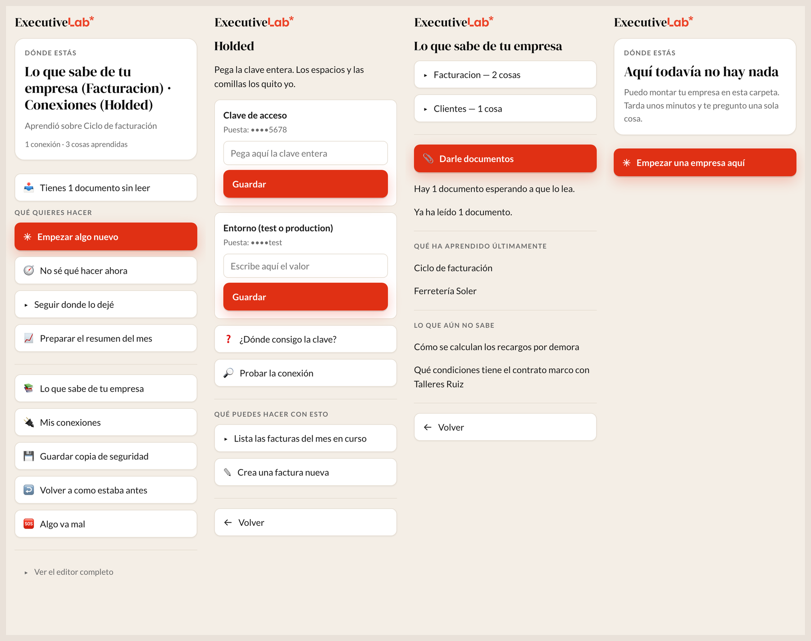
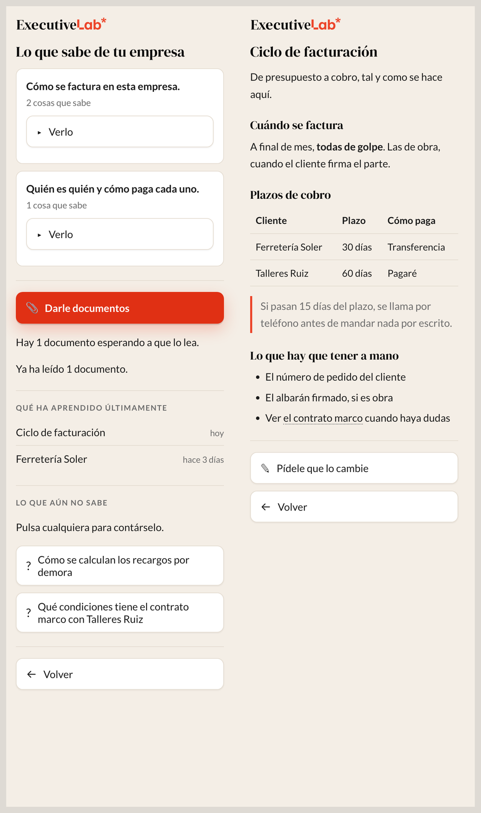
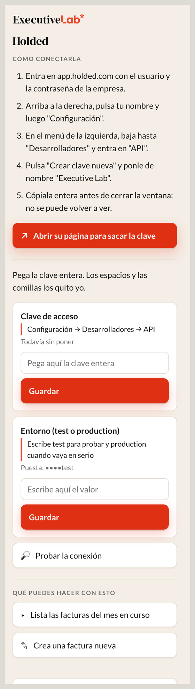
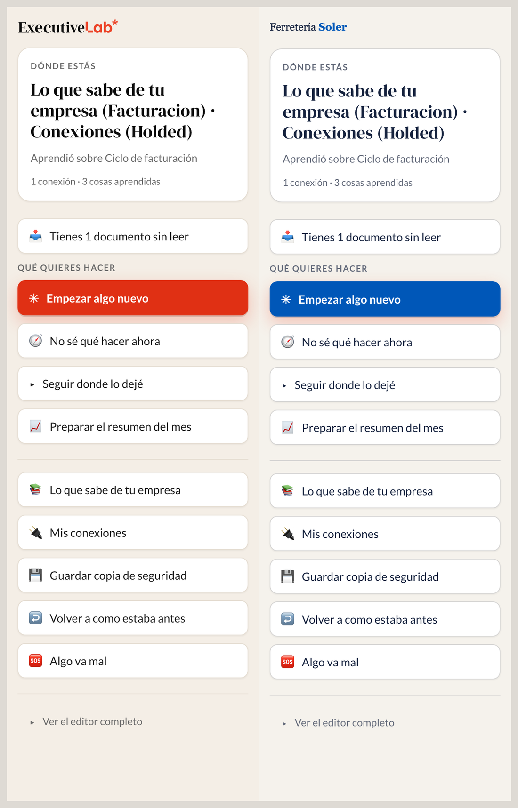

# Executive Lab — interfaz sin fricción sobre el arnés RSC

Una capa sobre VS Code para que alguien que **no programa** pueda trabajar con un agente de IA sin
ver nunca una terminal, una ruta de fichero ni la palabra «commit».

El motor es **Claude Code (o Codex) oficial**, interactivo, dentro de VS Code. Esto no es un chat:
es el instalador, el disfraz y los raíles que lo rodean. Por debajo, quien monta y gobierna el
espacio de trabajo es el arnés [RSC](https://github.com/ericrisco/rsc-harness).

> **¿Eres un agente de IA y te han pedido instalar esto?**
> Salta directo a **[Para agentes: instrucciones ejecutables](#-para-agentes-instrucciones-ejecutables)**.
> Está escrito para que lo sigas sin interpretar nada.

**Última release:** [v0.5.0](https://github.com/minarkap/executive-lab-interfaz/releases/latest) ·
`executive-lab-0.5.0.vsix`, 6 MB.

---

## Qué ve quien lo usa

Una barra lateral con una brújula —dónde estás, qué acabas de hacer, qué puedes hacer ahora— y
botones en lenguaje de negocio.



Lo que el arnés va aprendiendo del trabajo se lee **dentro** del panel, sin rutas, sin markdown y sin
la cabecera técnica del artículo:



Conectar una herramienta es un formulario guiado: los pasos que escribió el propio asistente al
investigarla, y debajo de cada campo, de dónde se saca esa clave en concreto:



Y cuando la persona dice cuál es la web de su empresa, el panel deja de llevar nuestra marca y lleva
la suya — mismos botones, sus colores, su logotipo:



### La regla que ordena el panel

**No hay ni una herramienta, ni una tarea, ni un tema escritos en el código.** Todo lo que se ve sale
de leer lo que RSC tenga montado en esa carpeta: las conexiones de `01-TOOLS/`, los comandos de
`.claude/commands/` que lleven `boton:`, los temas de `02-DOCS/wiki/`.

Una gestoría acaba con botones de facturación y una empresa de contratos con botones de contratos,
sin que nadie toque el código. Y aparecen solos: la barra vigila lo que el arnés escribe.

---

## Cómo se instala

Tres caminos. **El primero es el bueno**; los otros dos existen para casos concretos.

### 1. La extensión de VS Code — el camino principal

Sirve para quien ya tiene VS Code y una cuenta de pago de Claude Code o de Codex.

1. Descarga `executive-lab-<version>.vsix` de
   [la última release](https://github.com/minarkap/executive-lab-interfaz/releases/latest).
2. Arrástralo sobre la ventana de VS Code. (O `Ctrl+Shift+P` → *Extensions: Install from VSIX…*)
3. Abre la carpeta con la que quieras trabajar y pulsa **Preparar esta carpeta** en la barra de la
   izquierda. Te hará cinco preguntas en lenguaje llano y montará el arnés con tus respuestas.

**No hace falta Node ni npm:** VS Code ya lleva Node dentro y el arnés viaja dentro del `.vsix`.
Tampoco hace falta ningún permiso de administrador, y no hay aviso de SmartScreen ni de Gatekeeper
porque no es un ejecutable.

Requisitos: **VS Code 1.98 o más nuevo**, y **Claude Code o Codex** con cuenta de pago del que uses.

**git hace falta sí o sí**, y si no está, el panel lo instala con un botón: en Windows descarga y
lanza el instalador oficial de Git; en macOS lanza el de Apple. No lo repartimos nosotros. El porqué
está en la decisión 26: el arnés usa git por su cuenta, y sin él funciona a medias y sin decirlo.

### 2. El instalador de escritorio — para el portátil virgen

Para quien llega sin nada. Pone **las piezas**: VS Code, Node, git y las dos extensiones, todo
dentro de la carpeta del usuario y sin pedir administrador. El arnés no lo monta él: eso lo hace el
panel cuando esa persona elige carpeta, igual que por el camino de la extensión (decisión 27).

- **macOS:** `Executive Lab <version>.dmg` (103 MB). Se construye con `instalador/mac/construir.sh`.
- **Windows:** `ExecutiveLab-Setup.exe` (268 MB). `instalador/windows/preparar-carga.sh` y luego
  Inno Setup (ver [instalador/README.md](instalador/README.md)).

⚠️ **Hoy no se reparten.** Ninguno de los dos está firmado, así que macOS los bloquea con Gatekeeper
y Windows enseña *«Windows protegió tu PC»*. Antes de repartir cualquiera de los dos hay que
firmarlo.

### 3. Solo los raíles — sobre un RSC que ya existe

Los raíles son configuración sobre RSC: fijan el español, el vocabulario de negocio y la habilidad
`executive-lab`. No dependen ni del instalador ni de la extensión.

```bash
node skills/aplicar.js "~/Documentos/Mi Empresa IA"
```

No pisa nada de lo que haya escrito la persona y se puede repetir las veces que haga falta.

---

## 🤖 Para agentes: instrucciones ejecutables

Si eres un agente (Claude Code, Codex, Cursor…) y te han pedido instalar Executive Lab en la máquina
de alguien, esto es el procedimiento completo. Sigue el orden.

### Antes de empezar

**Pregunta y espera respuesta. No asumas.** Las respuestas del paso 3 son de esa persona, no tuyas:
condicionan cómo se comporta su arnés durante meses.

Comprueba las condiciones previas:

```bash
code --version          # debe existir y ser >= 1.98.0
git --version           # hace falta; si no está, el panel lo instala con un botón
```

⚠️ **En macOS no ejecutes `git --version` para comprobarlo** si puede no estar instalado:
`/usr/bin/git` existe siempre y es un señuelo que abre el diálogo de Apple. Usa `xcode-select -p`,
que responde sin abrir nada.

Si `code` no está en el `PATH` pero VS Code sí está instalado: en VS Code,
`Ctrl+Shift+P` → *Shell Command: Install 'code' command in PATH*.

Si **no hay VS Code**, no sigas por aquí: instálalo desde <https://code.visualstudio.com> (instalador
oficial y firmado) y vuelve a este paso.

También hace falta que esa persona tenga **Claude Code o Codex con una cuenta de pago**. Si no la
tiene, díselo ahora: sin ella, el panel se instala pero no hay agente detrás y se queda parado en la
pantalla de inicio de sesión.

### Paso 1 — instalar la extensión

```bash
# Descarga el .vsix de la última release
gh release download --repo minarkap/executive-lab-interfaz \
  --pattern '*.vsix' --dir /tmp --clobber

# Instálalo
code --install-extension /tmp/executive-lab-*.vsix --force
```

Sin `gh`:

```bash
curl -fL -o /tmp/executive-lab.vsix \
  "$(curl -fsSL https://api.github.com/repos/minarkap/executive-lab-interfaz/releases/latest \
     | grep -o 'https://[^"]*\.vsix')"
code --install-extension /tmp/executive-lab.vsix --force
```

### Paso 2 — comprobar que quedó puesta

```bash
code --list-extensions | grep executivelab.panel   # debe imprimir: executivelab.panel
```

Si no imprime nada, la instalación falló: mira la salida del paso 1 y **no sigas**.

### Paso 3 — el arnés, con las respuestas de esa persona

**Lo normal: no lo montes tú.** Dile que abra en VS Code la carpeta con la que quiere trabajar y que
pulse **Preparar esta carpeta** en la barra de la izquierda. El asistente de la extensión le hace las
cinco preguntas en lenguaje llano y monta el arnés con sus respuestas. Es el camino probado.

Solo si te pide expresamente que lo hagas tú, pregúntale las cinco cosas —una a una, sin sugerir la
respuesta— y luego:

```bash
cd "<su carpeta de trabajo>"

npx @ericrisco/rsc@1.4.1 onboard \
  --technical-level <non-technical|mixed|technical> \
  --accompaniment <L0|L1|L2|L3> \
  --project-kind <software|operations|research|content|mixed> \
  --goal "<lo que quiera conseguir, en sus palabras>" \
  --target <claude|codex>
```

Ese comando **imprime un plan y una huella, y no monta nada todavía**. Enséñale el plan. Solo cuando
lo acepte, repite el mismo comando con los mismos flags y añade la huella **tal cual la imprimió**:

```bash
npx @ericrisco/rsc@1.4.1 onboard ...los mismos flags... --accept-plan <huella>
```

Por último, los raíles de Executive Lab (idioma y vocabulario), que viajan dentro de la extensión:

```bash
node ~/.vscode/extensions/executivelab.panel-*/media/railes/aplicar.js "<su carpeta>"
```

### Paso 4 — verificar

```bash
cd "<su carpeta de trabajo>"
ls .rsc.json 01-TOOLS 02-DOCS .claude/settings.json   # los cuatro deben existir
ls .claude/skills/executive-lab/SKILL.md              # los raíles
```

### Lo que NO debes hacer

- **No enciendas la vista sencilla por tu cuenta.** Es un ajuste **por carpeta**
  (`executiveLab.vistaSencilla`) que reconfigura todo el editor. Lo decide esa persona, desde el
  botón de la barra o cuando el asistente se lo pregunte al terminar. Su editor es suyo.
- **No uses `@latest` para RSC.** Va fijada la **1.4.1** a propósito: toda una cohorte tiene que
  correr el mismo catálogo o dejan de servir las instrucciones de clase. RSC 2.x está publicado y
  todavía no se ha probado aquí.
- **No inventes las respuestas del onboarding.** Definen el tono, el idioma y cuánto le explica el
  asistente a esa persona durante meses.
- **No toques sus ajustes de usuario de VS Code.** La extensión escribe en `.vscode/settings.json`
  de la carpeta, precisamente para no alterar las demás ventanas.

### Si algo va mal

| Síntoma | Qué es | Qué hacer |
|---|---|---|
| `code: command not found` | El comando no está en el `PATH` | *Shell Command: Install 'code' command in PATH* desde VS Code |
| La barra lateral no aparece | La extensión no arrancó | Reinicia VS Code; comprueba el paso 2 |
| «Preparar esta carpeta» falla a mitad | El arnés quedó a medias | Borra `.rsc.json` y vuelve a pulsar; la salida queda en `instalacion.log` |
| Dice que falta una pieza | No hay `git` en el sistema | Pulsa el botón: lo instala. O instálalo tú |
| El panel no responde | Falta iniciar sesión en Claude Code o Codex | Que inicie sesión en la extensión del asistente |

Dentro del panel hay un botón **Algo va mal** que revisa, arregla lo que puede y da un código de seis
letras para el tutor.

---

## Qué lleva cada forma de distribución

Las tres no son equivalentes. Esto es lo que hay **hoy**:

Las tres llevan lo mismo, porque el arnés viaja en un solo sitio: dentro del `.vsix`.

| | `.vsix` (extensión) | `.dmg` (macOS) | `.exe` (Windows) |
|---|---|---|---|
| Versión del panel | **0.5.0** | **0.5.0** | **0.5.0** |
| Tamaño | 6 MB | 103 MB | 268 MB |
| Arnés RSC 1.4.1 | ✅ dentro del paquete | ✅ (dentro del `.vsix`) | ✅ (dentro del `.vsix`) |
| Raíles | ✅ `media/railes/` | ✅ (dentro del `.vsix`) | ✅ (dentro del `.vsix`) |
| Módulos compartidos | ✅ `media/comun/` | ✅ | ✅ |
| Disfraz (`disfraz.json`) | ✅ | ✅ | ✅ |
| git | ✅ obligatorio; lo instala el panel | ✅ lo instala el de Apple | ✅ lo instala el oficial de Git |
| Node | El que trae VS Code | `runtime/` dentro | `runtime/` dentro |
| Instala VS Code | ❌ | ✅ (lo descarga) | ✅ (lo lleva dentro) |
| Monta el arnés | El panel | El panel | El panel |
| Firmado | No hace falta | ❌ pendiente | ❌ pendiente |

---

## Cómo está hecho

| Carpeta | Qué es |
|---|---|
| [extension/](extension/) | La barra lateral: brújula, conexiones, wiki, marca y los botones que el arnés tenga |
| [instalador/](instalador/) | El doble clic: Node, VS Code, extensiones, perfil, RSC y la carpeta de trabajo |
| [skills/](skills/) | Los raíles conversacionales sobre RSC — configuración, no código |
| [perfil/](perfil/) | El disfraz como `.code-profile`, para probarlo a mano |
| [docs/](docs/) | Decisiones, auditoría, fricción y el diccionario |

[docs/diccionario.md](docs/diccionario.md) gobierna **todos** los textos: nada aparece en pantalla si
no está ahí, y hay un comprobador que lo verifica.

### Por qué no hay un cliente propio

Se evaluó y se descartó, con pruebas, por dos razones:

- **Facturación.** `claude -p` (no interactivo) y las apps de terceros que se autentican con la
  suscripción del usuario a través del Agent SDK consumen un crédito mensual aparte. Claude Code
  interactivo en terminal o IDE, no.
- **Términos.** *«Unless previously approved, Anthropic does not allow third party developers to
  offer claude.ai login or rate limits for their products.»*

Y el remate: la extensión `anthropic.claude-code` **ya es** una interfaz gráfica nativa sobre Claude
Code, gratis y mantenida por Anthropic, con *Focus view* — que esconde llamadas a herramientas,
resultados y razonamiento. La vista para no técnicos, ya construida.

Todas las decisiones, con lo que se descartó y por qué, están en
[docs/decisiones.md](docs/decisiones.md).

---

## Trabajar en esto

```bash
git clone git@github.com:minarkap/executive-lab-interfaz.git
cd executive-lab-interfaz

# El arnés que viaja dentro de la extensión NO está versionado. Antes de empaquetar:
npm install --prefix extension/media/harness @ericrisco/rsc@1.4.1
```

### Probarlo

```bash
cd extension && npm run probar          # 69 comprobaciones con un vscode de mentira
node extension/prueba/humo.js --con-arnes   # + monta un arnés de verdad (tarda minutos)
node docs/comprobar-diccionario.js      # ningún texto de pantalla usa palabra prohibida
node herramientas/revisar-powershell.js # los .ps1, antes de llevarlos a Windows
cd instalador/mac && ./probar.sh --casa /tmp/casa-falsa   # 14 comprobaciones, sin tocar tu Mac
```

### Verlo funcionando

```bash
./demo.sh --con-datos
```

Abre un VS Code **aislado** —sus propios ajustes y extensiones, dentro de `.demo/`, sin tocar los
tuyos— con la extensión de Claude y la nuestra instaladas de verdad, sobre una empresa de mentira ya
preparada con el arnés. Es lo que ve alguien tras el instalador, disfraz incluido. La primera vez
tarda un par de minutos. `rm -rf .demo` para empezar de cero.

### Empaquetar y publicar

```bash
cd extension && npm run empaquetar   # valida el manifiesto y genera el .vsix
./publicar.sh                        # pruebas + diccionario + .vsix + notas, en publicacion/
```

`publicar.sh` no publica nada: deja los ficheros listos y dice qué hacer con cada uno.

Para los instaladores de escritorio hay que montar antes la carpeta `carga/` con los binarios de
terceros, que no se versionan. Está explicado en [instalador/README.md](instalador/README.md).

---

## Estado

**Prototipo usable.** Auditado el 17 de septiembre de 2026.

**Probado de verdad:**

- El arnés montado desde cero en una carpeta vacía **con solo el Node que lleva VS Code** y la copia
  de RSC que viaja en la extensión: `RSC_ONBOARDING_READY` con el suelo completo.
- El instalador de Windows **ejecutado en una máquina real**: instaló, montó el arnés y se trabajó
  con ello. De esa tarde salieron doce fallos que ninguna prueba automática habría visto.
- 69 comprobaciones con un `vscode` de mentira y una empresa con la forma que deja RSC, más el
  asistente completo con `--con-arnes`.

**Lo que sigue sin probarse:** la extensión instalada desde el `.vsix` en una máquina limpia, el
`.dmg` y el `.exe` nuevos —construidos pero nunca ejecutados—, si los instaladores de git piden
administrador (decisión 26) y una sesión con alguien real de principio a fin.

Dónde queda fricción, ordenada por cuánta gente pierde cada punto:
[docs/friccion.md](docs/friccion.md). Los hallazgos de la auditoría, qué se corrigió y qué queda:
[docs/auditoria.md](docs/auditoria.md).

---

## Este repo también lleva el arnés

Está equipado con RSC en modo desarrollador. Se versionan `.rsc.json`, `.claude/settings.json` y
`.claude/rsc-bootstrap.mjs`; el resto está en `.gitignore`. Para retomarlo en otra máquina:

```bash
npx @ericrisco/rsc@1.4.1 sync
```

> RSC 2.x está publicado y aquí va fijada la 1.4.1 a propósito. Un salto de versión mayor puede
> cambiar el arnés, y hay que probarlo antes de que llegue a nadie.

---

## Licencia

Todos los derechos reservados. El código se publica para poder inspeccionarlo, instalarlo y
auditarlo; no hay licencia de uso, copia ni distribución. Si quieres usarlo, escribe.
